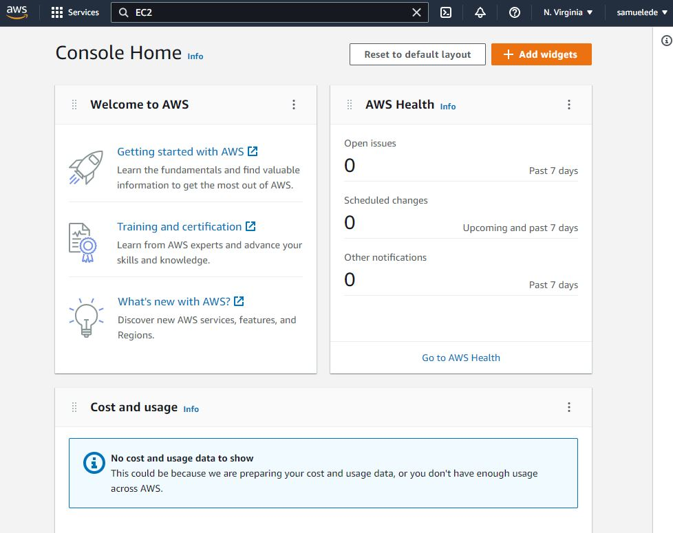
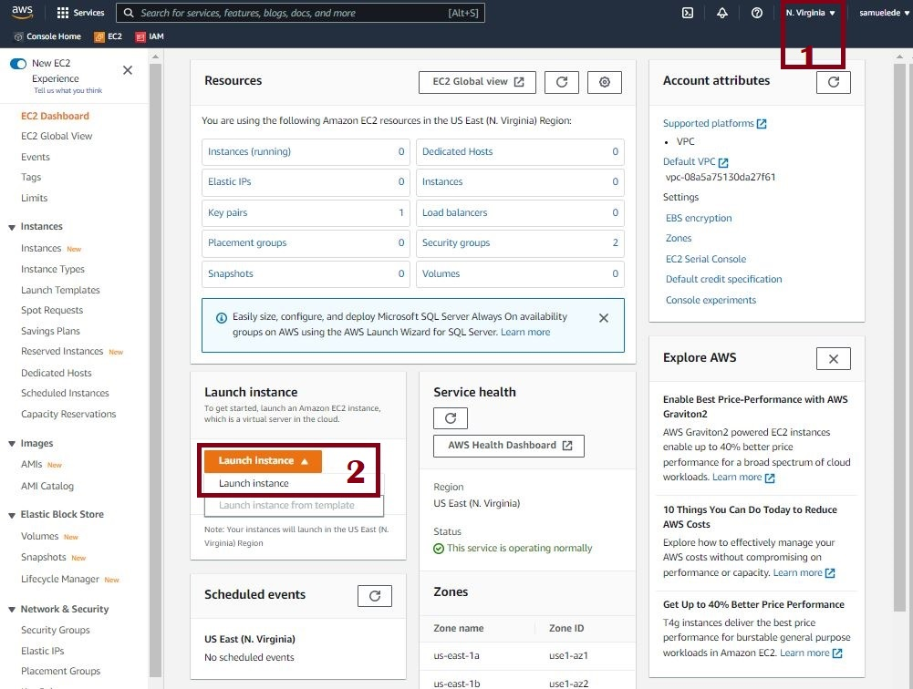

# DevOps PBL with AWS
# Project 1 Report

## Darey.io - DevOps Project Based Learning Project 1 Documentation

JULY 2022

## LAMP STACK IMPLEMENTATION

### STEP 0 – Web Stack Implementation (LAMP Stack) in AWS

A technology stack is a set of frameworks and tools used to develop a software product. This set of frameworks and tools are very specifically chosen to work together in creating a well-functioning software. They are acronymns for individual technologies used together for a specific technology product. some examples are…
LAMP (Linux, Apache, MySQL, PHP or Python, or Perl)
LEMP (Linux, Nginx, MySQL, PHP or Python, or Perl)
MERN (MongoDB, ExpressJS, ReactJS, NodeJS)
MEAN (MongoDB, ExpressJS, AngularJS, NodeJS
Our goal in this section is to:

- Register and setup a FREE AWS account.
- Create a new AWS EC2 Instance
- Setup and Provision an Ubuntu Server
- Connect to an EC2 instance

Step 0 of 1 - Creating an aws account. Type in an email address and suitable AWS console name and click verify email address. Sign in to the email account and verify your account.

Step 0 of 2 - sign in to AWS account using new root user email after clicking the sign in link

Step 0 of 3 - Overview of the AWS console, Regions, Cost and usage, and other settings. In this case we type in EC2 in the search bar to find and create a new AWS instance.

Step 0 of 4 - Select the EC2 instance and also check the star icon to add it to the favorite section of the console homepage.

Step 0 of 5 - Select a preferred region as highlighted in the top right above to select a preferable region and/or change. Next click and select Launch instance as shown in 2.

Step 0 of 6 - Type in a preferred instance name and in the Applications and OS Images section select Ubuntu and the ubuntu server 22.04

Next, click create a key pair and type a key name, select RSA and .pem private key option.

Step 0 of 7 - Click create new key pair and save the file in your downloads folder and In the Network Settings, click select existing security group previously created from the common security groups drop down, then finally click on Launch Instance.

Step 0 of 8 - After clicking Lauch instance, the above page should show up. Next, click View all instances.

Step 0 of 9 - The above image shoes the resulting features. To check the status of the server, click on the refresh button as in 1, then click the checkbox as in 2 above to view the server details below and finally click connect as in 3 above to to connect to the Server.

Step 0 of 10 - After clicking connect, select the SSH client tab. The above details would b visible. Click on the copy icon beside 
ssh - i “<yourpemkeyname.pem” ubuntu@ec2-<ip address>.compute-1.amazon.com 
This is used in our ssh client to connect remotely to our server.

Step 0 of 11 - Open your preferred terminal and change directory to your stored .pem key location as shown above, if stored in the downloads folder type command 
'cd c:/users/<pcname>/downloads' and hit enter. Then type the command 
ssh - i “<yourpemkeyname.pem” ubuntu@ec2-<ip address>.compute-1.amazon.com
On the command line and hit enter. A green prompt with our server ip should pop up as shown in the above image.

The objective of these steps are to setup our server environment to enable us install the necessary prerequisites, application software, databases and other software deployment tools to be used for deployment and hosting of our websites or software applications.

Step 1 – Installing apache and updating firewall
Apache HTTP Server is the most widely used web server software. Developed and maintained by Apache Software Foundation, Apache is an open source software available for free. It runs on 67% of all webservers in the world.
Our goal with this  installation is to:
Install an apache server on our ubuntu virtual machine
Configure the server and set firewall rules

Step 1 of 1 - Type the following in your recently launched command line 
sudo apt update  this would update the list of packages available in our ubuntu box as shown above.
 

Step 1 of 2 - Next type in sudo apt install apache2 and hit enter. The resulting page should look like tha above image.

Step 1 of 3 - Next type systemctl status apache2 to verify the status of the running apache service. A green active status would confirm the status of our installed apache server in the cloud.

Step 1 of 4 - To verify and access out server locally on our ubuntu command line, type the following:
curl http://localhost:80 or  curl http://127.0.0.1:80 
The above image shows the content of the resulting html file that can be viewed publicly. The ‘curl’ command indicates to our apache http server on port 80 to request for the server default page.

Step 1 of 5 - to test our server default page on a browser, open a browser and type in http://<public-ip-address>: 80 using the ip address provided after our instance was created. The 80 means the default port used by browsers to connect to our apache web server. The resulting page should look like the image above.

Step 1 of 6 - Another way to check our ip address rather than through the aws console  is to type in curl -s http://<ip-address>/latest/meta-data/public-ipv4
As shown above.

Step 2 – Installing MySQL
In step 2 we will install a Database Management System (DBMS) to be able to store and manage data for your site in a relational database. MySQL is a popular relational database management system used within PHP environments, so we will use it in our project.

Step 2 of 1 - type in the following command to begin installation of mysql server
sudo apt install mysql-server
A prompt will ask to confirm the installation process, type y to proceed.

Step 2 of 2 - type the following command after the installation is complete to confirm mysql server running status. sudo service mysql status
A green active status confirms our mysql server installation in the above diagram.

Step 2 of 3 - to login to our  installed mysql database server, type sudo mysql in the terminal prompt. The above image shows the resulting output and new mysql> prompt. Type exit to exit the mysql shell.

Step 2 of 4 - To make our sql server more secure with a password, we use the following command to achieve this. sudo mysql_secure installation 
Answer y for yes and/or anything else. Follow the prompts and type in a secure password to complete the process as shown above.

Step 2 of 5 - To login securely to our mysql console, type sudo mysql -p in the command line and type in the newly specified password. The above shows the result of the command. Type exit to close the mysql console.
This would always prompt for a password everytime we want to access the mysql console.

Step 3 – Installing PHP

Now that we have Apache installed to serve your content and MySQL installed to store and manage your data. PHP is the component of our setup that will process code to display dynamic content to the end user. In addition to the php package, you’ll need 
php-mysql, a PHP module that allows PHP to communicate with MySQL-based databases. You’ll also need libapache2-mod-php to enable Apache to handle PHP files. Core PHP packages will automatically be installed as dependencies.

Step 3 of 1 - To install php type the following command 
sudo apt install php libapache2-mod-php php-mysql in the ssh prompt to begin the installation process. The above shows the next steps, type y at the prompt to confirm yes and proceed.

Step 3 of 2 - Once the installation is complete type php -v to confirm the php version as shown above.

After this, we would have successfully installed all components of the LAMP (Linux, Apache, MySQL, PHP) stack. 

Step 4 – Creating a Website Virtual Host using APACHE
In step 4, we will set up a domain called projectlamp, but you can replace this with any domain of your choice.
Apache on Ubuntu 20.04 has one server block enabled by default that is configured to serve documents from the /var/www/html directory.
We will leave this configuration as is and will add our own directory next next to the default one.

Step 4 of 1 - Type in the command sudo mkdir /var/www/projectlamp to create a new directory/folder in our php installation. The command mkdir in linux creates a folder followed by the  path of the new folder location.
Next, type cd /var/www/projectlamp to change directory to the new folder location as shown above. To assign ownership of the directory, also type 
sudo chown -R $USER:$USER /var/www/projectlamp
The we create a new configuration file in apache’s sites-available directory with the following command, sudo vi /etc/apache2/sites-available/projectlamp.conf
After running the above command, a blank file is created and opened as shown below.

Step 4 of 2 - Type i and paste the following code into the configuration file as show in the image above:
<VirtualHost *:80>
    ServerName projectlamp
    ServerAlias www.projectlamp 
    ServerAdmin webmaster@localhost
    DocumentRoot /var/www/projectlamp
    ErrorLog ${APACHE_LOG_DIR}/error.log
    CustomLog ${APACHE_LOG_DIR}/access.log combined
</VirtualHost>
Next, hit esc , type :  , and type wq w for write and q to quit and then finally hit enter to save the file.

Step 4 of 3 - Next type sudo ls /etc/apache2/sites-available to show the available files in the directory as shown above.
The following 000-default.conf  default-ssl.conf  projectlamp.conf displays confirming the newly created file and other files as shown in the image above.
Next, we type sudo a2ensite projectlamp to enable our projectlamp as our virtual host and the root directory of our web application as shown above.
Next, type sudo a2dissite 000-default to disable abache’s default website
Next, type sudo apache2ctl configtest to confirm our configuratoin file is syntax error free
Finally, type sudo systemctl reload apache2 to reload apache for changes to take effect.
Next we need to create a new file for our empty web root location. We create an index.html file for this purpose. Copy and pase the following command to perform this task as shown in the image above.
sudo echo 'Hello LAMP from hostname' $(curl -s http://169.254.169.254/latest/meta-data/public-hostname) 'with public IP' $(curl -s http://169.254.169.254/latest/meta-data/public-ipv4) > /var/www/projectlamp/index.html
Next, in our browser, we type the following to see the changes. http://<Public-IP-Address>:80

Our html page shows successfully as shown in the above image. This will be the temporary default page until we install an application with an index.php page to replace it.
 

Step 5 – Enable PHP on the Website
The default DirectoryIndex settings on Apache, a file named index.html will always take precedence over an index.php file. This is useful for setting up maintenance pages in PHP applications, by creating a temporary index.html file containing an informative message to visitors.
In case you want to change this behavior, you’ll need to edit the /etc/apache2/mods-enabled/dir.conf file and change the order in which the index.php file is listed within the DirectoryIndex directive:

Step 5 of 1 - In the command line, type in sudo vim /etc/apache2/mods-enabled/dir.conf
The above diagram is the resulting output.

Step 5 of 2 - Copy the following and replace the above content with this:
<IfModule mod_dir.c>
        #Change this:
        #DirectoryIndex index.html index.cgi index.pl index.php index.xhtml index.htm
        #To this:
        DirectoryIndex index.php index.html index.cgi index.pl index.xhtml index.htm
</IfModule>

Step 5 of 3 - After saving the file, close and refresh the server using the following command to effect the changes. sudo systemctl reload apache2

Next, we will create a PHP script to test our PHP configurations are run correctly.

Step 5 of 4 - To create a new PHP file, type vim /var/www/projectlamp/index.php this will open a blank file. Add the following code to the file.
<?php
phpinfo();

Save and close the file. 

Step 5 of 5 -  Then refresh the page in the browser to see the changes. The above page appears in our browser and provides the PHP  information on our server, used for debugging and ensuring the settings are up to speed.

Step 5 of 6 - After checking the PHP settings, we need to remove the file because it contains critical server information about our PHP envronment.
Use the rm command to remove the file by typing the following:
sudo rm /var/www/projectlamp/index.php
This completes all the requirements for our project 1. 

