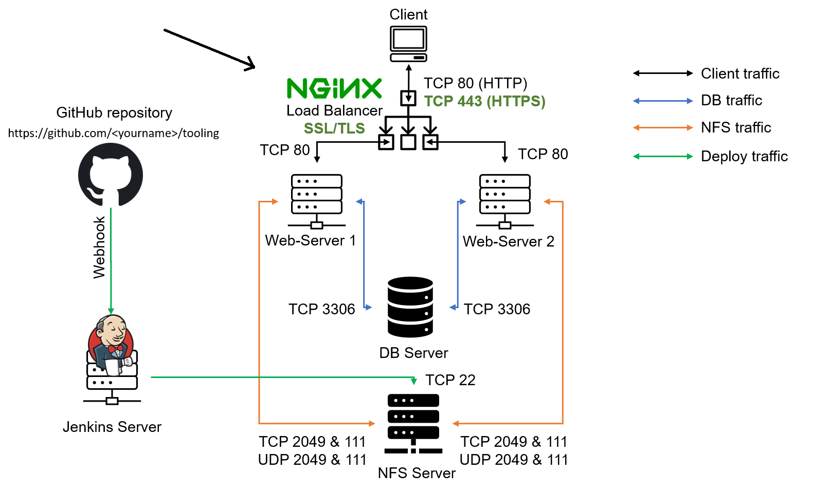

# DevOps PBL
# Project 10 Report

# Darey.io - DevOps Project Base Learning Project 10 Documentation

October 2022

## LOAD BALANCER SOLUTION WITH NGINX AND SSL/TLS

### Task
This project consists of two parts:

1. [Configure Nginx as a Load Balancer](#step-1---configure-nginx-as-a-load-balancer)
2. [Register a new domain name and configure secured connection using SSL/TLS certificates](#step-2---register-a-new-domain-name-and-configure-secured-connection-using-ssltls-certificates)

Your target architecture will look like this:



### Step 1 - CONFIGURE NGINX AS A LOAD BALANCER

We can either uninstall Apache from the existing Load Balancer server, or create a fresh installation of Linux for Nginx.

1. Create an EC2 VM based on Ubuntu Server 20.04 LTS and name it **Nginx LB** (do not forget to open TCP port 80 for HTTP connections, also open TCP port 443 – this port is used for secured HTTPS connections)
2. Update **/etc/hosts** file for local DNS with Web Servers’ names (e.g. **Web1** and **Web2**) and their local IP addresses
3. Install and configure Nginx as a load balancer to point traffic to the resolvable DNS names of the webservers

Update the instance and Install Nginx. Run the following commands to achieve this:

`sudo apt update`
`sudo apt install nginx`

Configure Nginx LB using Web Servers’ names defined in /etc/hosts

Open the default nginx configuration file with the command:

`sudo vi /etc/nginx/nginx.conf`

```
#insert following configuration into http section
upstream myproject {
server Web1 weight=5;
server Web2 weight=5;
}
server {
listen 80;
server_name www.domain.com;
location / {
proxy_pass http://myproject;
}
}
#comment out this line
# include /etc/nginx/sites-enabled/*;
```

Restart Nginx and make sure the service is up and running with the next commands:

`sudo systemctl restart nginx`

`sudo systemctl status nginx`

### Step 2 - Register a new domain name and configure secured connection using SSL/TLS certificates

In order to get a valid SSL certificate – you need to register a new domain name, you can do it using any Domain name registrar – a company that manages reservation of domain names. The most popular ones are:
Godaddy.com, Domain.com, Bluehost.com.

1. Register a new domain name with any registrar of your choice in any
domain zone (*e.g. .com, .net, .org, .edu, .info, .xyz or any other*)
2. Assign an Elastic IP to your Nginx LB server and associate your
domain name with this Elastic IP
3. Update A record in your registrar to point to Nginx LB using Elastic IP
address.
4. Configure Nginx to recognize your new domain name. Update your *nginx.conf* with *server_name www.<your-domain-name.com>*
instead of *server_name www.domain.com*
5. Install **certbot** and request for an SSL/TLS certificate. Make sure snapd service is active and running

`sudo systemctl status snapd`

Install cerbot

`sudo snap install --classic certbot`

Request your certificate (just follow the certbot instructions – you will need to choose which domain you want your certificate to be issued for, domain name will be looked up from nginx.conf file so make sure you have updated it on step 4).

`sudo ln -s /snap/bin/certbot /usr/bin/certbot`
`sudo certbot --nginx`

Test secured access to your Web Solution by trying to reach *https://<your-domain-name.com>*

You shall be able to access your website by using HTTPS protocol (that uses TCP port 443) and see a padlock pictogram in your browser’s search string.
Click on the padlock icon and you can see the details of the certificate issued for your website.

6. Set up periodical renewal of your SSL/TLS certificate.
By default, LetsEncrypt certificate is valid for 90 days, so it isrecommended to renew it at least every 60 days or more frequently.
You can test renewal command in dry-run mode 

`sudo certbot renew --dry-run`

Best pracice is to have a scheduled job that to run renew
commandperiodically. Let us configure a cronjob to run the command twice a day.
To do so, lets edit the crontab file with the following command:

`crontab -e`

Add following line:

`* */12 * * * root /usr/bin/certbot renew > /dev/null 2>&1`

You can always change the interval of this cronjob if twice a day is toooften by adjusting schedule expression.

Finally, You have just implemented an Nginx Load Balancing Web Solution withsecured HTTPS connection with periodically updated SSL/TLScertificates.
