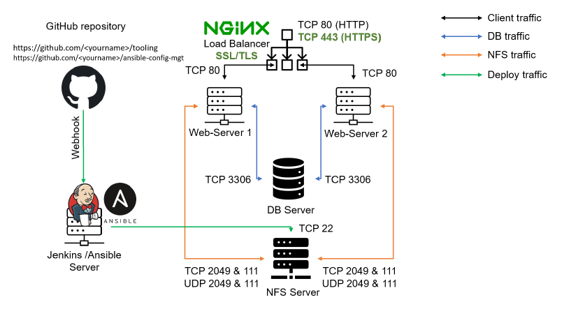

# DevOps PBL
# Project 11 Report

# Darey.io - DevOps Project Base Learning Project 11 Documentation

November 2022

## ANSIBLE - AUTOMATE PROJECT 7 - 10

### Task
This project consists of two parts:

1. Install and configure Ansible client to act as a Jump Server/BastionHost
2. Create a simple Ansible playbook to automate servers configuration

Your target architecture will look like this:

In the diagram above the Virtual Private Network (VPC) is divided into
two subnets – Public subnet has public IP addresses and Private subnet
is only reachable by private IP addresses.

### INSTALL AND CONFIGURE ANSIBLE ON EC2 INSTANCE
1. Update **Name** tag on your **Jenkins** EC2 Instance to **Jenkins-Ansible**. We will use this server to run playbooks.
2. In your GitHub account create a new repository and name it *ansible-config-mgt*.
3. Instal Ansible by runnin the following

`sudo apt update`

`sudo apt install ansible`

Check your Ansible version by running `ansible --version`

4. Configure Jenkins build job to save your repository content every time
you change it – this will solidify your Jenkins configuration skills
acquired in Project 9.

- Create a new Freestyle project ansible in Jenkins and point it to your
**‘ansible-config-mgt’** repository.
- Configure Webhook in GitHub and set webhook to trigger *ansible* build.
- Configure a Post-build job to save all (**) files, like you did it in Project9.

5. Test your setup by making some change in README.MD file in *master*
branch and make sure that builds starts automatically and Jenkins
saves the files (build artifacts) in following folder

`ls /var/lib/jenkins/jobs/ansible/builds/<build_number>/archive/`

Note: Trigger Jenkins project execution only for /main (master) branch.
Now your setup will look like this:

