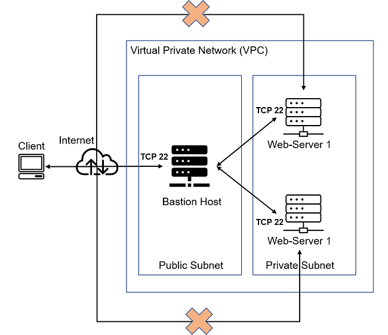

# DevOps PBL
# Project 11 Report

# Darey.io - DevOps Project Base Learning Project 11 Documentation

November 2022

## ANSIBLE - AUTOMATE PROJECT 7 - 10

### Task
This project consists of two parts:

1. Install and configure Ansible client to act as a Jump Server/BastionHost
2. Create a simple Ansible playbook to automate servers configuration

Your target architecture will look like this:

In the diagram above the Virtual Private Network (VPC) is divided into
two subnets – Public subnet has public IP addresses and Private subnet
is only reachable by private IP addresses.

### INSTALL AND CONFIGURE ANSIBLE ON EC2 INSTANCE
1. Update **Name** tag on your **Jenkins** EC2 Instance to **Jenkins-Ansible**. We will use this server to run playbooks.
2. In your GitHub account create a new repository and name it *ansible-config-mgt*.
3. Instal Ansible by runnin the following

`sudo apt update`

`sudo apt install ansible`

Check your Ansible version by running `ansible --version`
