# DevOps PBL with AWS
# Project 2 Report

## Darey.io - DevOps Project Based Learning Project 2 Documentation

JULY 2022

## LEMP STACK IMPLEMENTATION

### STEP 0 - Preparing prerequisites

What is Lemp in Linux?
LEMP is an open-source web application stack used to develop web applications. The term LEMP is an acronym that represents L for the Linux Operating system, Nginx (pronounced as engine-x, hence the E in the acronym) web server, M for MySQL database, and P for PHP scripting language. (curled from geeksforgeeks.org)
In order to complete this project you will need an AWS account and a virtual server with Ubuntu Server OS.
If you do not have an AWS account – go back to Project 1 Step 0 to sign in to AWS free tier account and create a new EC2 Instance of t2.nano family with Ubuntu Server 22.04 LTS (HVM) image and logi to the via the terminal.

### Step 1 - Installing the NGINX Web Server 

To enable web pages  to be visible to visitors, we require an Nginx web server to display the web pages. The apt  package manager is used to install this feature. 
We begin by installing Nginx using the following commands:

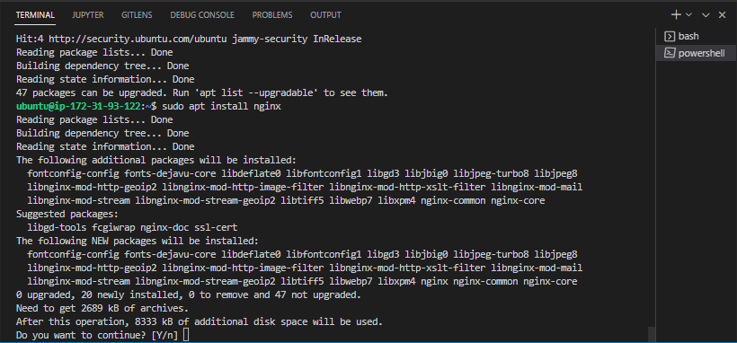

Step 1 of 1 - Type the following at the terminal as shown above.
sudo apt update hit enter then type sudo apt install nginx
At the prompt, type y to confirm and continue Nginx installation.

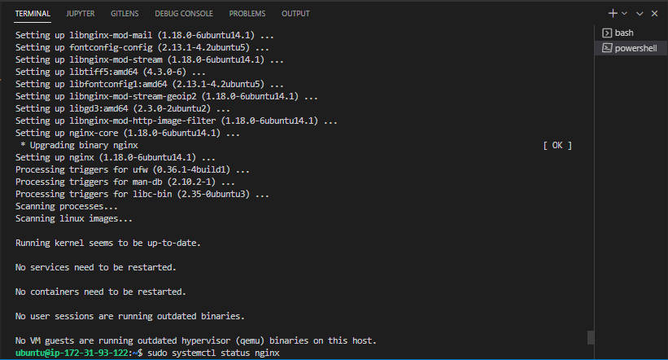

Step 1 of 2 - After the installation is complete, run the following command to check the status of the installation. sudo systemctl status nginx

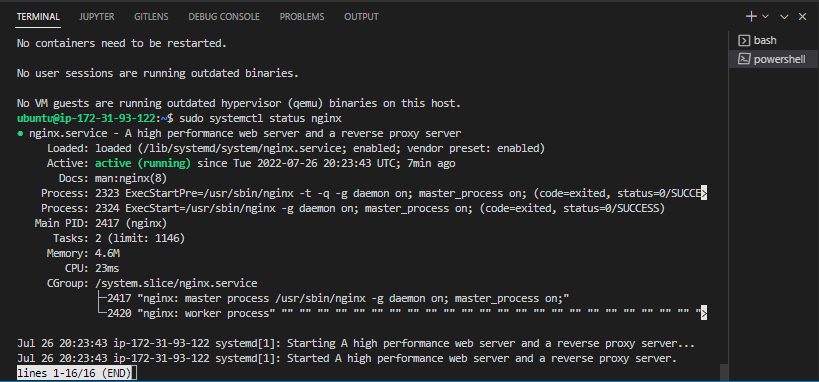

Step 1 of 3 - The green active (runing) state confirms a successful Nginx server installation also suggesting the launch of the web server in the cloud. Type q if you want to exit the server.

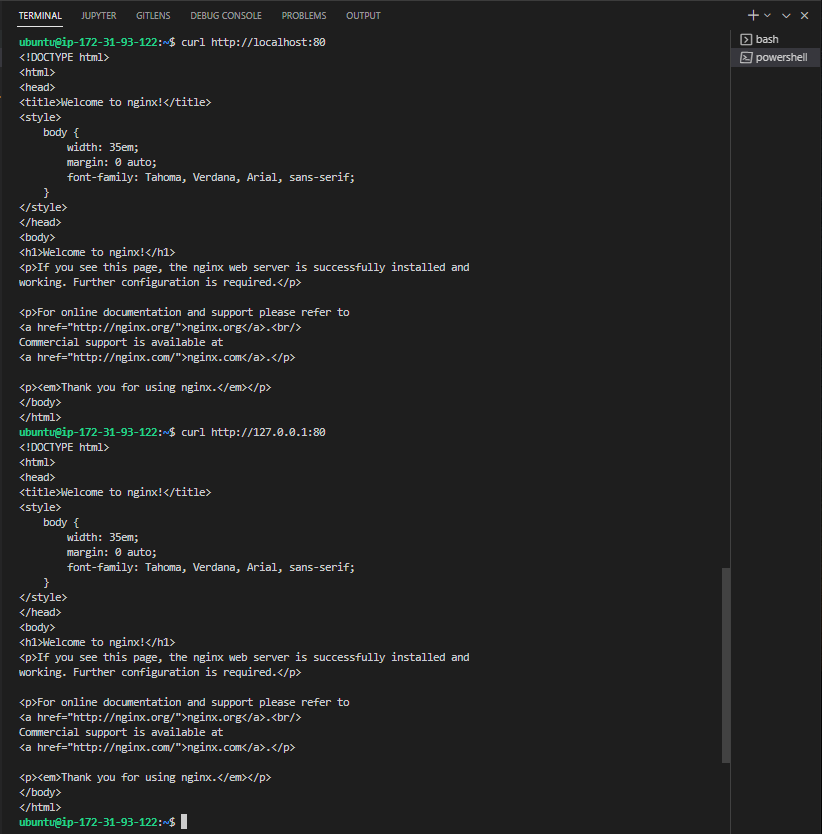

Step 1 of 4 - Next, we can access our webpage via port 80, type the following commands to achieve this:  curl http://localhost:80 or curl http://127.0.0.1:80
The first url uses the DNS name to access the web server while the second url uses the server IP address. 

To test our web server on a browser, we type the follwoing command.

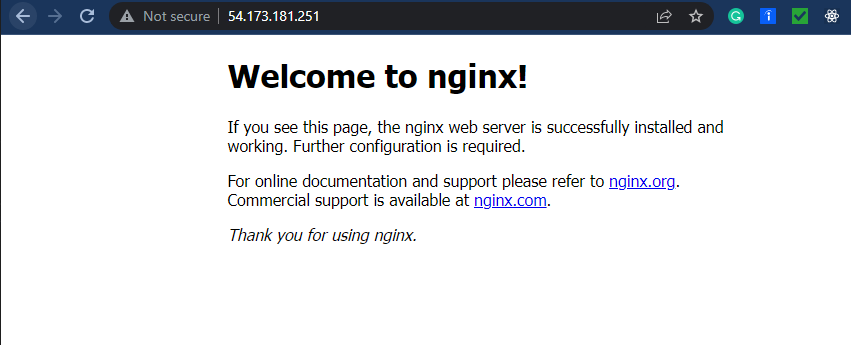

Step 1 of 5 - In the browser type http://<Public-IP-Address>:80

Another method of accessing the server ip address is by typing the following command:

curl -s http://169.254.169.254/latest/meta-data/public-ipv4
The above image shows the current ip address of our working AWS server.

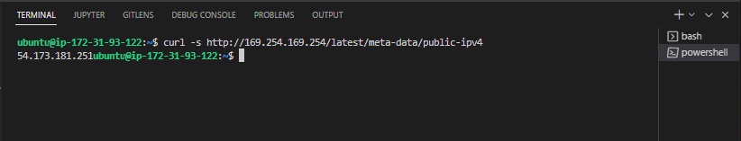

### Step 2 - Installing MySQL

In step 2, the next step is to install our database (DBMS) server, now that our Nginx server installation is complete.  

Again we use the ‘apt’ command to gather the requirements and install the software.

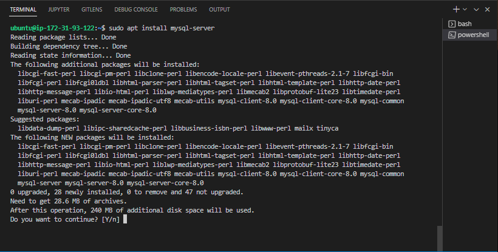
    
Step 2 of 1 - Run the command sudo apt install mysql-server and hit enter. Type y to accept and continue the process as showen in the image above.

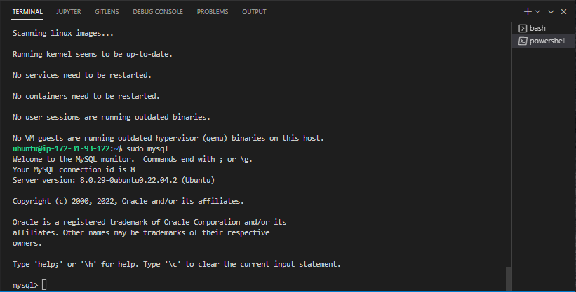
    
Step 2 of 2 - At the command line type sudo mysql to launch the mysql console as shown above.

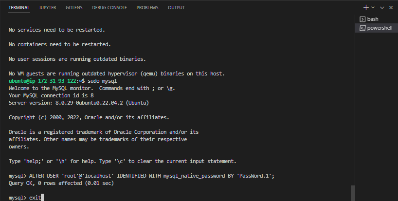
    
Step 2 of 3 - Run the following command and hit enter to update the root default password. 
ALTER USER 'root'@'localhost' IDENTIFIED WITH mysql_native_password BY 'PassWord.1';
Next, type exit to exit from the mysql shell.

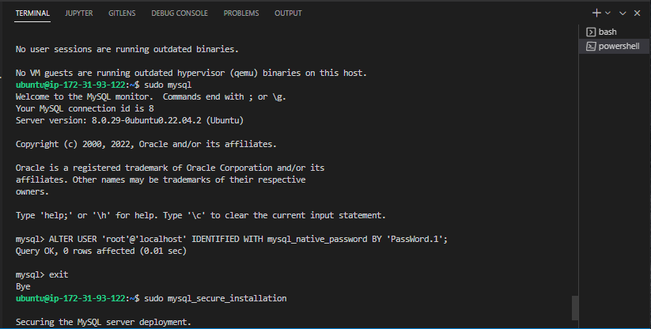
    
Step 2 of 4 - Next, run the command sudo mysql_secure_installation and follow the steps, firstly typing the default root password ‘PassWord.1’ and following the instructions and prompts as shown below.

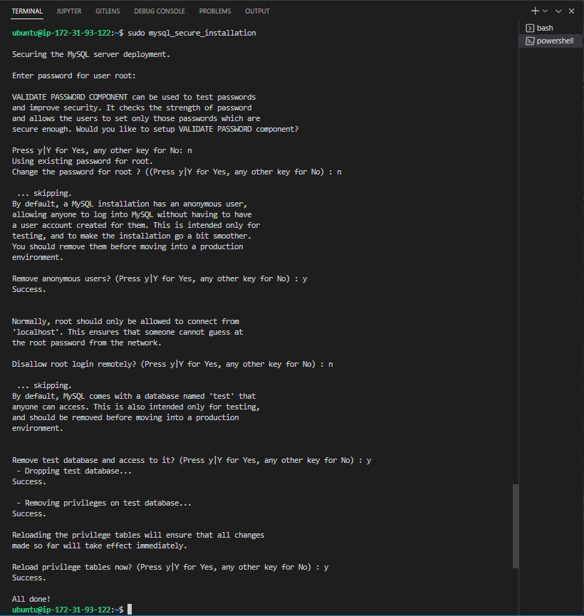

### Step 3 - Installing PHP

To install PHP to process our codes and generate dynamic content via the web server, we need to install a few packages from the command line so our Nginx server can process PHP requestst. 

    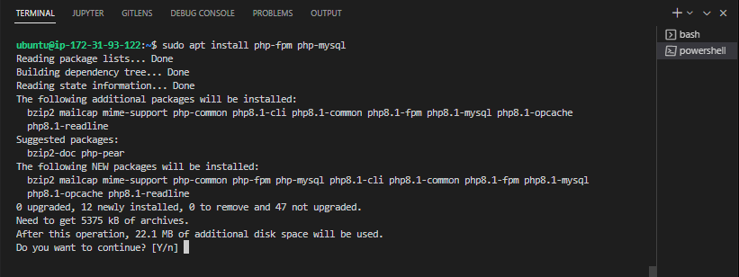
    
Step 3 of 1 - Run the following command sudo apt install php-fpm php-mysql to begin the PHP installation process, type y and hit Enter to to continue as shown above.
    
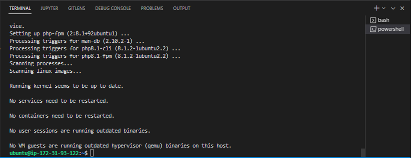

All done.

### Step4 - Configuring NGINX to use PHP Processor 

The first step is to crreate a web directory for our domain as follows:

Step 4 of 1 - Type the following commands to create a web directory, assign permissions and set a configuration file.
sudo mkdir /var/www/projectLEMP
sudo chown -R $USER:$USER /var/www/projectLEMP
sudo nano /etc/nginx/sites-available/projectLEMP

Step 4 of 2 - Copy and paste the follwoing code into the terminal by right clicking in the terminal space.  The type CTRL+x and then y and ENTER  to save, close and confirm changes.
#/etc/nginx/sites-available/projectLEMP
server {
    listen 80;
    server_name projectLEMP www.projectLEMP;
    root /var/www/projectLEMP;

    index index.html index.htm index.php;

    location / {
        try_files $uri $uri/ =404;
    }

    location ~ \.php$ {
        include snippets/fastcgi-php.conf;
        fastcgi_pass unix:/var/run/php/php8.1-fpm.sock;
     }

    location ~ /\.ht {
        deny all;
    }
}

Step 4 of 3 - Run the command 
sudo ln -s /etc/nginx/sites-available/projectLEMP /etc/nginx/sites-enabled/

Step 4 of 4 - Also run the following commands to complete the nginx php installation
sudo nginx -t
The following message confirms a successful config test
nginx: the configuration file /etc/nginx/nginx.conf syntax is ok
nginx: configuration file /etc/nginx/nginx.conf test is successful

sudo unlink /etc/nginx/sites-enabled/default
sudo systemctl reload nginx
sudo echo 'Hello LEMP from hostname' $(curl -s http://169.254.169.254/latest/meta-data/public-hostname) 'with public IP' $(curl -s http://169.254.169.254/latest/meta-data/public-ipv4) > /var/www/projectLEMP/index.html

Step 4 of 5 - Next go to your browser and type http://<Public-IP-Address>:80
The Hello text from th echo command confirms the Nginx site processes our index file properly.

Step 5 - Testing PHP with Nginx

At this stage our LEMP stack setup is complete. To test our server can process .php files, we create and edit a php document in our document root on the Nginx server. 

Step 5 of 1 - Run the command sudo nano /var/www/projectLEMP/info.php
Copy and paste the following by right clicking in the terminal:
<?php
phpinfo();
Type CTRL+X and then Y and finally hit ENTER TO SAVE AND EXIT.

To test our .php file.

Step 5 of 2 - Type the following in a browser as shown above; http://`server_domain_or_IP`/info.php

Step 5 of 3 - Run the following command to remove the created .php file as it contains sensitive server details. sudo rm /var/www/your_domain/info.php

Step 6 - RETRIEVING DATA FROM MYSQL DATABASE WITH PHP (CONTINUED)

At this stage we wil create a test database with a simple ‘To Do List’and configure access to it, then our Nginx website can query the database and display the content.

The first step will be to create a database named example_database including a user named example_user. 

Step 6 of 1 - Run the following command sudo mysql or sudo mysql - p if a database password is already set.
At the mysql console, type CREATE DATABASE example_database; as shown above.

Step 6 of 2 - Run the following commands at the mysql prompt mysql>  to create a database user and grand privileges to the created user as shown above.
CREATE USER 'example_user'@'%' IDENTIFIED WITH mysql_native_password BY 'password';
GRANT ALL ON example_database.* TO 'example_user'@'%';
Then run exit to exit the console

Step 6 of 3 - Next, we test the new user access by running the following command, then create a new table for our database as shown above. mysql -u example_user -p
At the mysql prompt, next type SHOW DATABASES; to view available databases.
Next, type the following MySQL query to create a table.
 CREATE TABLE example_database.todo_list (
 item_id INT AUTO_INCREMENT,
 content VARCHAR(255),
PRIMARY KEY(item_id)
);

Step 6 of 4 - To insert some records into our table, run the following SQL commands:
INSERT INTO example_database.todo_list (content) VALUES ("My first important item");
Editing the query values to add more content.

To view the saved/inserted records, run the following SQL command.
SELECT * FROM example_database.todo_list;
The result would correspond with the image above. Next, type exit to exit the mysql console.

Next, we create a .php file to access our database record and display them in the browser.

Step 6 of 5 - Run the following command in the terminal to create and edit a .php file for our todo list.
nano /var/www/projectLEMP/todo_list.php
Next, copy the following PHP code and righ click in the terminal area to paste the content
<?php
$user = "example_user";
$password = "password";
$database = "example_database";
$table = "todo_list";

try {
  $db = new PDO("mysql:host=localhost;dbname=$database", $user, $password);
  echo "<h2>TODO</h2><ol>";
  foreach($db->query("SELECT content FROM $table") as $row) {
    echo "<li>" . $row['content'] . "</li>";
  }
  echo "</ol>";
} catch (PDOException $e) {
    print "Error!: " . $e->getMessage() . " ";
    die();
}?>

Save the file and exit. 

Step 6 of 6 - To view the resulttep 6 of 5 - Run the following command in the terminal to create and edit a .php file for our todo list.
http://<Public_domain_or_IP>/todo_list.php

We have successfully cofigured and tested our Ngix server with PHP and MySQL.
