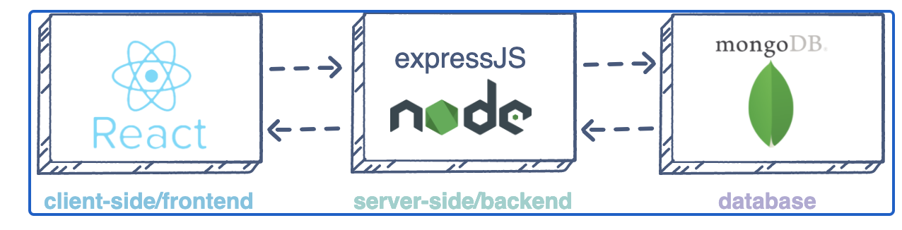
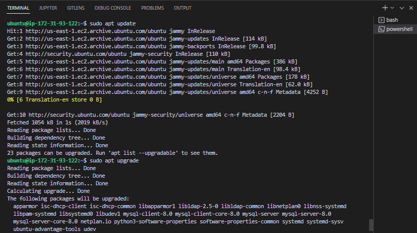
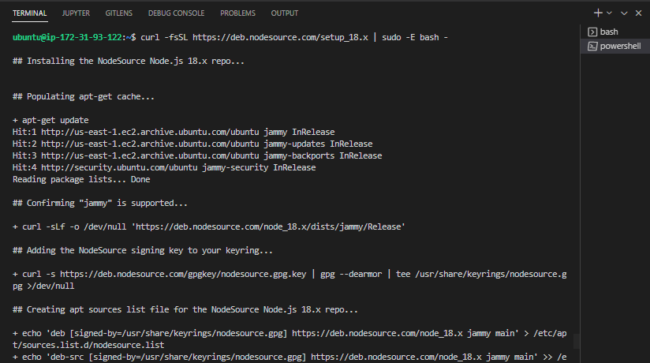
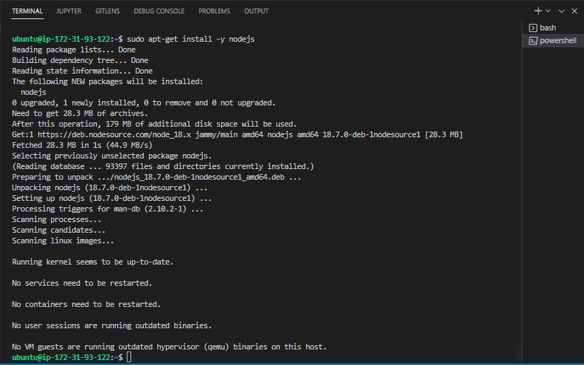
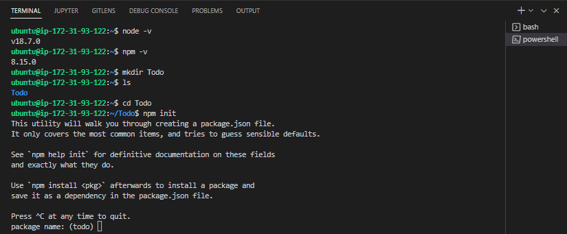
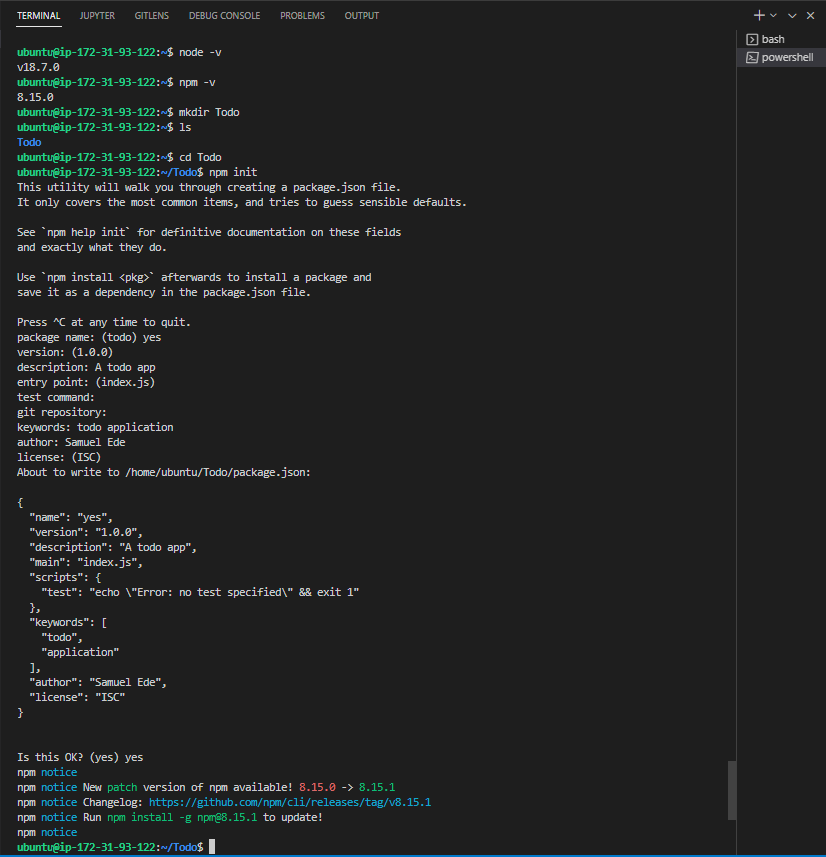
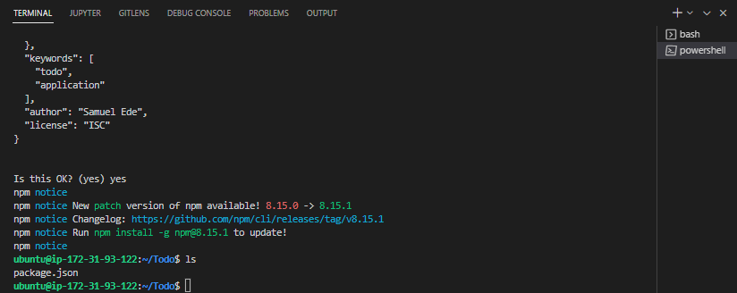
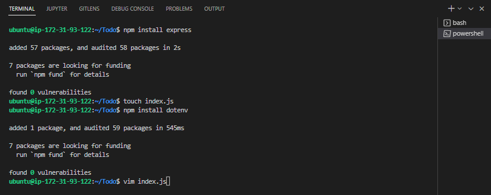
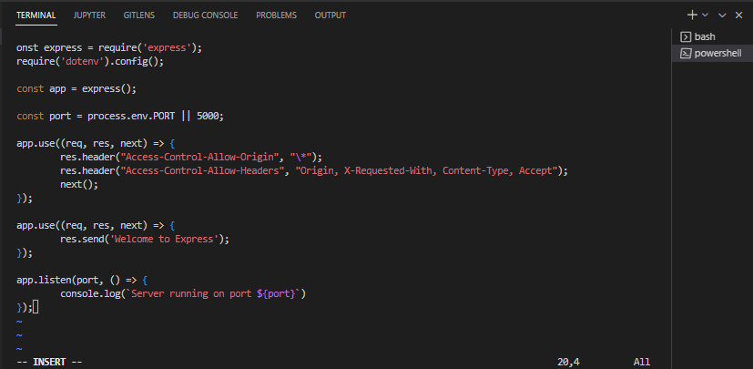
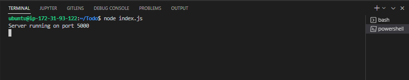

# DevOps PBL
# Project 3 Report

## Darey.io - DevOps Project Base Learning Project3 Documentation

JULY 2022

# MERN STACK IMPLEMENTATION

## Introduction & Background

MERN Web stack consists of following components:
MongoDB: A document-based, No-SQL database used to store application data in a form of documents.
ExpressJS: A server side Web Application framework for Node.js.
ReactJS: A frontend framework developed by Facebook. It is based on JavaScript, used to build User Interface (UI) components.
Node.js: A JavaScript runtime environment. It is used to run JavaScript on a machine rather than in a browser.
In project 3, we will implement a web solution on MERN stack in AWS Cloud.

Step 0 - Preparing prerequisites 

In order to complete this project you will need an AWS account and a virtual server with Ubuntu Server OS.
If you do not have an AWS account – go back to Project 1 Step 0 to sign in to AWS free tier account and create a new EC2 Instance of t2.nano family with Ubuntu Server 22.04 LTS (HVM) image and logi to the via the terminal.

Step 1 - BackEnd Configuration

Step 1 of 1 - After setting up and/or starting a new instance, run the command: 
sudo apt update and sudo apt upgrade as shown above to get the latest ubuntu software. At the prompt type  y and hit enter to continue the process. Select all options available to restart if applicable and then ok to complete the restart process.

Step 1 of 2 - Run the folowing command to get and the Node.js location for installation.
curl -fsSL https://deb.nodesource.com/setup_18.x | sudo -E bash -

Step 1 of 3 - Run the command sudo apt-get install -y nodejs to install Node.js. 
This command installs nodejs and npm. NPM is a package manager for Node like apt for Ubuntu. 

Step 1 of 4 - Verify node installation and create a new directory for our Todo application with the following cmmands at the terminal:
 node -v then npm -v then mkdir Todo next ls to view the directory contents.
Run cd Todo to move into our application directory, then run npm init to initialize the project.

Step 1 of 5 - At the prompt type yes and hit enter and provide suitable answers at the prompt s shown above. Then run ls to confirm the package.json file has been created as shown below.

Step 1 of 6 - Next, install Express by running the command npm install express 
Then create a file indexjs with touch.js with the command touch index.js
Then run ls to confirm the index.js file was created.
Next, install the dotenv module with the command npm install dotenv
Then, run vim index.js to edit the file.
Copy and paste the following codes by right clicking in the terminal to paste into the file.

const express = require('express');
require('dotenv').config();

const app = express();

const port = process.env.PORT || 5000;

app.use((req, res, next) => {
res.header("Access-Control-Allow-Origin", "\*");
res.header("Access-Control-Allow-Headers", "Origin, X-Requested-With, Content-Type, Accept");
next();
});

app.use((req, res, next) => {
res.send('Welcome to Express');
});

app.listen(port, () => {
console.log(`Server running on port ${port}`)
});

Step 1 of 7 - After pasting the code, note the port number specified as 5000 in the code. Then hit the esc key and type :w to save the file and :qa to exit vim.

Step 1 of 8 - Next, run the following command node index.js to start the node server and test if it works. To exit node type CTRL C
Routes - There are three actions that our To-Do application needs to perform:
Create a new task 2. Display task list 3. Delete completed task
Each task will be associated with some particular endpoint and will use different standard HTTP request methods: POST, GET, DELETE.
For each task, we need to create routes that will define various endpoints that the To-do app will depend on. So let us create a folder routes

Step 1 of 10 - To change the directory routes folder, run cd routes in the terminal. Next, run touch api.js and next vim api.js to edit the new created file. Copy and paste the code below and save. The image above shows a view of the pasted code.
const express = require ('express');
const router = express.Router();

router.get('/todos', (req, res, next) => {

});

router.post('/todos', (req, res, next) => {

});

router.delete('/todos/:id', (req, res, next) => {

})

module.exports = router;

Step 1 of 11 - Since the app will use of Mongodb which is a NoSQL database, we need to create a model. of Mongodb which is a NoSQL database, we need to create a model.
Change directory back Todo folder with cd .. and install Mongoose npm install mongoose 
Create a new folder models by running mkdir models Change directory into the newly created ‘models’ folder with cd models
Inside the models folder, create a file and name it todo.js by running  touch todo.js
As shown above.  Alternatively, you can also run mkdir models && cd models && touch todo.js  to complete all the task at once.
Copy and paste the following code:
const mongoose = require('mongoose');
const Schema = mongoose.Schema;

//create schema for todo
const TodoSchema = new Schema({
action: {
type: String,
required: [true, 'The todo text field is required']
}
})

//create model for todo
const Todo = mongoose.model('todo', TodoSchema);

module.exports = Todo;

Step 1 of 13 - Now we need to update our routes from the file api.js in ‘routes’ directory to make use of the new model.
In Routes directory, open api.js with vim api.js delete the code inside with :%d command and paste there code below into it then save and exit
const express = require ('express');
const router = express.Router();
const Todo = require('../models/todo');

router.get('/todos', (req, res, next) => {

//this will return all the data, exposing only the id and action field to the client
Todo.find({}, 'action')
.then(data => res.json(data))
.catch(next)
});

router.post('/todos', (req, res, next) => {
if(req.body.action){
Todo.create(req.body)
.then(data => res.json(data))
.catch(next)
}else {
res.json({
error: "The input field is empty"
})
}
});

router.delete('/todos/:id', (req, res, next) => {
Todo.findOneAndDelete({"_id": req.params.id})
.then(data => res.json(data))
.catch(next)
})

module.exports = router;

Next we need to create a MongoDB database.  Sign up here. Follow the sign up process, select AWS as the cloud provider, and choose a region near you to setup a free account. Allow access to the MongoDB database from anywhere.

Step 1 of 14 - In the index.js file, we specified process.env to access environment variables, but we have not yet created this file. So we need to do that now. Create a file in your Todo directory and name it .env by running touch .env then vi .env

Add the connection string to access the database in it, just as below:
DB = 'mongodb+srv://<username>:<password>@<network-address>/<dbname>?retryWrites=true&w=majority'
Ensure to update <username>, <password>, <network-address> and <database> according to your setup. Here is how to get your connection string

Now we need to update the index.js to reflect the use of .env so that Node.js can connect to the database. Simply delete existing content in the file, and update it with the entire code below.
To do that using vim. Open the file with vim index.js Press esc Type : Type %d Hit ‘Enter’
The entire content will be deleted, then, 
Press i to enter the insert mode in vim
Now, paste the entire code below in the file and save. Then start the server with the command node index.js as shown in the image above.

const express = require('express');
const bodyParser = require('body-parser');
const mongoose = require('mongoose');
const routes = require('./routes/api');
const path = require('path');
require('dotenv').config();

const app = express();

const port = process.env.PORT || 5000;

//connect to the database
mongoose.connect(process.env.DB, { useNewUrlParser: true, useUnifiedTopology: true })
.then(() => console.log(`Database connected successfully`))
.catch(err => console.log(err));

//since mongoose promise is depreciated, we overide it with node's promise
mongoose.Promise = global.Promise;

app.use((req, res, next) => {
res.header("Access-Control-Allow-Origin", "\*");
res.header("Access-Control-Allow-Headers", "Origin, X-Requested-With, Content-Type, Accept");
next();
});

app.use(bodyParser.json());

app.use('/api', routes);

app.use((err, req, res, next) => {
console.log(err);
next();
});

app.listen(port, () => {
console.log(`Server running on port ${port}`)
});

Next step, we test our api using Postman to test our API. Click HERE to learn how perform CRUD operartions on Postman
** Had a few issues getting positive requests on postman

Step  2 - FRONTEND CREATION

Having created the functionality from the backend and API, we now need to create a user interface for the browse to communicate with the applicaiton via our API. To begin the frontend of our Todo app, we run the create-reat-app command to setup our app. 

Step 2 of 1 - In the Todo directory run npx create-react-app client
This will create the client directory in the Todo where the react code will reside. Select y to proceed at the prompt and hit enter.

Step 2 of 2 - Some dependencies need to be installed before testing the react app.
 First, we install concurrently by running the following command 
npm install concurrently –save-dev
Next, we install nodemon by running the command npm install nodemon –save-dev

Step 2 of 3 - In the Todo folder, open the package.json file by running vim package.json and replace the script section with the following code as shown above. 
"scripts": {
"start": "node index.js",
"start-watch": "nodemon index.js",
"dev": "concurrently \"npm run start-watch\" \"cd client && npm start\""
},

Step 2 of 4 - change the directory to client by running cd client open the package.json file running vi package.json in the command line then add the following key pair value to the package.json file
“Proxy”: “http://localhost:5000”
The aim of adding the proxyconfiguration is to enable our app accessible directly from a browser on http://localhost:5000 rather than http://localhost:5000/todos

Step 2 of 5 - Next, make sure the path is inside the Todo directory by running cd .. the the following command to configure the server, npm run dev as shown above.
On completion, the app should be running on localhost:3000
Type CTRL+Z to exit npm.

Step 2 of 6 - Next, we install our react components. First we change the current directory by running cd client then cd src then creating a new directory in src called components with mkdir components. Next, run cd components to move into the components directory and create new files using the command 
touch Input.js ListTodo.js Todo.js as shown above.
Next, edit the Input.js file by running the command vi Input.js copy the following code and paste into the terminal and save.
import React, { Component } from 'react';
import axios from 'axios';

class Input extends Component {

state = {
action: ""
}

addTodo = () => {
const task = {action: this.state.action}

    if(task.action && task.action.length > 0){
      axios.post('/api/todos', task)
        .then(res => {
          if(res.data){
            this.props.getTodos();
            this.setState({action: ""})
          }
        })
        .catch(err => console.log(err))
    }else {
      console.log('input field required')
    }

}

handleChange = (e) => {
this.setState({
action: e.target.value
})
}

render() {
let { action } = this.state;
return (

<input type="text" onChange={this.handleChange} value={action} />
<button onClick={this.addTodo}>add todo</button>

)
}
}

export default Input

Step 2 of 7 - Next, run cd .. twice to move from the components folder to the clients directory and type the following command npm install axios to install axios a promis based http client as shown in the image above. 

Step 2 of 8 - To install some frontend components, run the command cd src/components to move to the components directory. Next, run vi ListTodo.js and copy the following code and paste. 
import React from 'react';

const ListTodo = ({ todos, deleteTodo }) => {

return (
<ul>
{
todos &&
todos.length > 0 ?
(
todos.map(todo => {
return (
<li key={todo._id} onClick={() => deleteTodo(todo._id)}>{todo.action}</li>
)
})
)
:
(
<li>No todo(s) left</li>
)
}
</ul>
)
}

export default ListTodo

Next, run vi Todo.js then also copy and paste the following code
import React, {Component} from 'react';
import axios from 'axios';

import Input from './Input';
import ListTodo from './ListTodo';

class Todo extends Component {

state = {
todos: []
}

componentDidMount(){
this.getTodos();
}

getTodos = () => {
axios.get('/api/todos')
.then(res => {
if(res.data){
this.setState({
todos: res.data
})
}
})
.catch(err => console.log(err))
}

deleteTodo = (id) => {

    axios.delete(`/api/todos/${id}`)
      .then(res => {
        if(res.data){
          this.getTodos()
        }
      })
      .catch(err => console.log(err))

}

render() {
let { todos } = this.state;

    return(
      

        <h1>My Todo(s)</h1>
        <Input getTodos={this.getTodos}/>
        <ListTodo todos={todos} deleteTodo={this.deleteTodo}/>
      

    )

}
}

export default Todo;

Next, change the directory to src by typing cd .. and in the src directory run vi App.js to edit the app file. Copy and paste the following code 
import React from 'react';

import Todo from './components/Todo';
import './App.css';

const App = () => {
return (

<Todo />

);
}

export default App;

Exit the editor and open the App.css file using the command vi App.css then copy and paste the following code.
.App {
text-align: center;
font-size: calc(10px + 2vmin);
width: 60%;
margin-left: auto;
margin-right: auto;
}

input {
height: 40px;
width: 50%;
border: none;
border-bottom: 2px #101113 solid;
background: none;
font-size: 1.5rem;
color: #787a80;
}

input:focus {
outline: none;
}

button {
width: 25%;
height: 45px;
border: none;
margin-left: 10px;
font-size: 25px;
background: #101113;
border-radius: 5px;
color: #787a80;
cursor: pointer;
}

button:focus {
outline: none;
}

ul {
list-style: none;
text-align: left;
padding: 15px;
background: #171a1f;
border-radius: 5px;
}

li {
padding: 15px;
font-size: 1.5rem;
margin-bottom: 15px;
background: #282c34;
border-radius: 5px;
overflow-wrap: break-word;
cursor: pointer;
}

@media only screen and (min-width: 300px) {
.App {
width: 80%;
}

input {
width: 100%
}

button {
width: 100%;
margin-top: 15px;
margin-left: 0;
}
}

@media only screen and (min-width: 640px) {
.App {
width: 60%;
}

input {
width: 50%;
}

button {
width: 30%;
margin-left: 10px;
margin-top: 0;
}
}

Exit and save.

Also in the src directory run the command vi index.css
Then copy and paste the following code.
body {
margin: 0;
padding: 0;
font-family: -apple-system, BlinkMacSystemFont, "Segoe UI", "Roboto", "Oxygen",
"Ubuntu", "Cantarell", "Fira Sans", "Droid Sans", "Helvetica Neue",
sans-serif;
-webkit-font-smoothing: antialiased;
-moz-osx-font-smoothing: grayscale;
box-sizing: border-box;
background-color: #282c34;
color: #787a80;
}

code {
font-family: source-code-pro, Menlo, Monaco, Consolas, "Courier New",
monospace;
}

Next, goto the Todo directory by running this command cd ../..
Then run npm run dev as shown in the image above.

Supposing no errors appear, our Todo app is complete and fully ready to explore the features such as create, delete and view tasks.

