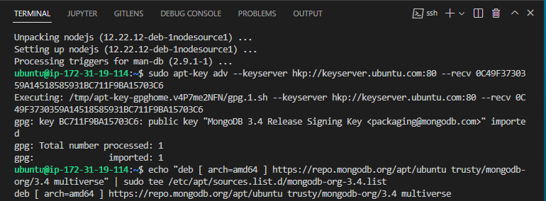

# DevOps PBL
# Project 4 Report

## Darey.io - DevOps Project Base Learning Project4 Documentation

JULY 2022

# MEAN STACK IMPLEMENTATION


### Introduction & Background

Now, when you have already learned how to deploy LAMP, LEMP and MERN Web stacks – it is time to get yourself familiar with MEAN stack and deploy it to Ubuntu server.

MEAN Stack is a combination of following components:
MongoDB (Document database) – Stores and allows to retrieve data.
Express (Back-end application framework) – Makes requests to Database for Reads and Writes.
Angular (Front-end application framework) – Handles Client and Server Requests
Node.js (JavaScript runtime environment) – Accepts requests and displays results to end user
Task
In this assignment you are going to implement a simple Book Register web form using MEAN stack.

### Step 0 - Preparing prerequisites
In order to complete this project you will need an AWS account and a virtual server with Ubuntu Server OS.
If you do not have an AWS account – go back to [Project 1 Step 0](https://github.com/samuelede/devops-pbl-projects/blob/main/project1/README.md#step-0--web-stack-implementation-lamp-stack-in-aws) to sign in to AWS free tier account and create a new EC2 Instance of t2.nano family with Ubuntu Server 20.04 LTS (HVM) image and connect to the server via the terminal.


### Step 1 - Install NodeJs
Node.js is a JavaScript runtime built on Chrome’s V8 JavaScript engine. Node.js is used in this tutorial to set up the Express routes and AngularJS controllers. To update ubuntu run `sudo apt update`
to upgrade ubuntu, run 
`sudo apt upgrade`

Add certificates 
`sudo apt -y install curl dirmngr apt-transport-https lsb-release ca-certificates` 
then
`curl -sL https://deb.nodesource.com/setup_12.x | sudo -E bash -`

Install NodeJS `sudo apt install -y nodejs`


### Step 2 - Install MongoDB
MongoDB stores data in flexible, *JSON-like* documents. Fields in a database can vary from document to document and data structure can be changed over time. For our example application, we are adding book records to MongoDB that contain book name, isbn number, author, and number of pages.



Step 2 of 1 - Run the command `sudo apt-key adv --keyserver hkp://keyserver.ubuntu.com:80 --recv 0C49F3730359A14518585931BC711F9BA15703C6`
Then also 
```
echo "deb [ arch=amd64 ] https://repo.mongodb.org/apt/ubuntu trusty/mongodb-org/3.4 multiverse" | sudo tee /etc/apt/sources.list.d/mongodb-org-3.4.list
```

Next, run the following command to install mongodb `sudo apt install -y mongodb`


Step 2 of 2 - Run the command `sudo service mongodb start` to start the server then,  `sudo systemctl status mongodb` to check the mongodb server status.  
Next, run `sudo apt install -y npm`. Install body-parser package. We need ‘body-parser’ package to help us process JSON files passed in requests to the server. Also run, 
`sudo npm install body-parser`


Step 2 of 3 - Create a folder named ‘Books’by running  `mkdir Books` && `cd Books`
Accept all settings by hitting enter. In the Books directory, Initialize npm project with the command `npm init`. Add a file to it named server.js by running `vi server.js`
Copy and paste the following code in the terminal and save.
```
var express = require('express');
var bodyParser = require('body-parser');
var app = express();
app.use(express.static(__dirname + '/public'));
app.use(bodyParser.json());
require('./apps/routes')(app);
app.set('port', 3300);
app.listen(app.get('port'), function() {
    console.log('Server up: http://localhost:' + app.get('port'));
});
```


### Step 3 - Install Express and set up routes to the server

Express is a minimal and flexible *Node.js*  web application framework that provides features for web and mobile applications. We will use Express in to pass book information to and from our MongoDB database.
We also will use Mongoose package which provides a straight-forward, schema-based solution to model your application data. We will use Mongoose to establish a schema for the database to store data of our book register.


Step 3 of 1 - Run the command `sudo npm install express mongoose` then run 
`mkdir apps` && `cd apps` Next, create a file named *routes.js* with the command  
`vi routes.js`

Copy and paste the following code and save.

```
var Book = require('./models/book');
module.exports = function(app) {
  app.get('/book', function(req, res) {
    Book.find({}, function(err, result) {
      if ( err ) throw err;
      res.json(result);
    });
  }); 
  app.post('/book', function(req, res) {
    var book = new Book( {
      name:req.body.name,
      isbn:req.body.isbn,
      author:req.body.author,
      pages:req.body.pages
    });
    book.save(function(err, result) {
      if ( err ) throw err;
      res.json( {
        message:"Successfully added book",
        book:result
      });
    });
  });
  app.delete("/book/:isbn", function(req, res) {
    Book.findOneAndRemove(req.query, function(err, result) {
      if ( err ) throw err;
      res.json( {
        message: "Successfully deleted the book",
        book: result
      });
    });
  });
  var path = require('path');
  app.get('*', function(req, res) {
    res.sendfile(path.join(__dirname + '/public', 'index.html'));
  });
};
```


Step 3 of 2 - In the ‘apps’ folder, create a folder named models type the command `mkdir models && cd models` Create a file named *book.js* by running the command
`vi book.js`
Copy and paste the following code into ‘books.js’ and save.

```
var mongoose = require('mongoose');
var dbHost = 'mongodb://localhost:27017/test';
mongoose.connect(dbHost);
mongoose.connection;
mongoose.set('debug', true);
var bookSchema = mongoose.Schema( {
  name: String,
  isbn: {type: String, index: true},
  author: String,
  pages: Number
});
var Book = mongoose.model('Book', bookSchema);
module.exports = mongoose.model('Book', bookSchema);
```

### Step 4 - Access the routes with AngularJS

AngularJS provides a web framework for creating dynamic views in your web applications. In this tutorial, we use AngularJS to connect our web page with Express and perform actions on our book register.


Step 4 of 1 - Change the directory back to ‘Books’ by running the command `cd ../..`
Create a folder named public with the command `mkdir public && cd public`
Add a file named script.js with the command `vi script.js`
Copy and paste the Code below (controller configuration defined) into the *script.js* file.

```
var app = angular.module('myApp', []);
app.controller('myCtrl', function($scope, $http) {
  $http( {
    method: 'GET',
    url: '/book'
  }).then(function successCallback(response) {
    $scope.books = response.data;
  }, function errorCallback(response) {
    console.log('Error: ' + response);
  });
  $scope.del_book = function(book) {
    $http( {
      method: 'DELETE',
      url: '/book/:isbn',
      params: {'isbn': book.isbn}
    }).then(function successCallback(response) {
      console.log(response);
    }, function errorCallback(response) {
      console.log('Error: ' + response);
    });
  };
  $scope.add_book = function() {
    var body = '{ "name": "' + $scope.Name + 
    '", "isbn": "' + $scope.Isbn +
    '", "author": "' + $scope.Author + 
    '", "pages": "' + $scope.Pages + '" }';
    $http({
      method: 'POST',
      url: '/book',
      data: body
    }).then(function successCallback(response) {
      console.log(response);
    }, function errorCallback(response) {
      console.log('Error: ' + response);
    });
  };
});
```

Step 4 of 2 - In public  folder, create a file named *index.html* using the command 
`vi index.html`
Copy and paste the code below into *index.html* file.

```
<!doctype html>
<html ng-app="myApp" ng-controller="myCtrl">
  <head>
    <script src="https://ajax.googleapis.com/ajax/libs/angularjs/1.6.4/angular.min.js"></script>
    <script src="script.js"></script>
  </head>
  <body>
    <div>
      <table>
        <tr>
          <td>Name:</td>
          <td><input type="text" ng-model="Name"></td>
        </tr>
        <tr>
          <td>Isbn:</td>
          <td><input type="text" ng-model="Isbn"></td>
        </tr>
        <tr>
          <td>Author:</td>
          <td><input type="text" ng-model="Author"></td>
        </tr>
        <tr>
          <td>Pages:</td>
          <td><input type="number" ng-model="Pages"></td>
        </tr>
      </table>
      <button ng-click="add_book()">Add</button>
    </div>
    <hr>
    <div>
      <table>
        <tr>
          <th>Name</th>
          <th>Isbn</th>
          <th>Author</th>
          <th>Pages</th>

        </tr>
        <tr ng-repeat="book in books">
          <td>{{book.name}}</td>
          <td>{{book.isbn}}</td>
          <td>{{book.author}}</td>
          <td>{{book.pages}}</td>

          <td><input type="button" value="Delete" data-ng-click="del_book(book)"></td>
        </tr>
      </table>
    </div>
  </body>
</html>
```


Step 4 of 3 - Change the directory back up to Books with `cd ..` command. Start the server by running this command: `node server.js`
The server is now up and running, we can connect it via port 3300. You can launch a separate terminal console to test what *curl* command returns locally by running the command: `curl -s http://localhost:3300`

It shall return an HTML page, it is hardly readable in the CLI, but we can also try and access it from the Interne using `http://<public-ip-address>:3300` in a browser. Run `curl -s http://169.254.169.254/latest/meta-data/public-ipv4` to view the Public IP address of the server


