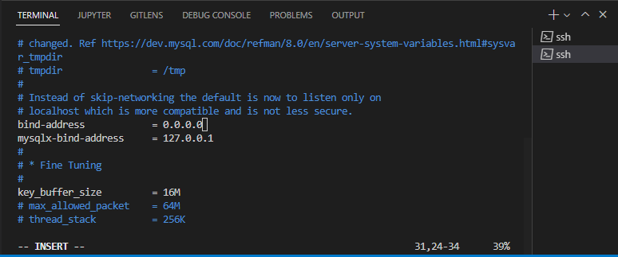

# DevOps PBL
# Project 5 Report

##Darey.io - DevOps Project Base Learning Project 5 Documentation

JULY 2022

## CLIENT-SERVER ARCHITECTURE WITH MYSQL

## IMPLEMENT A CLIENT SERVER ARCHITECTURE USING MYSQL DATABASE MANAGEMENT SYSTEM (DBMS).

To demonstrate a basic client-server using MySQL Relational Database Management System (RDBMS), follow the below instructions
1. Create and configure two Linux-based virtual servers (EC2 instances in AWS).
Server A name - `mysql server`
Server B name - `mysql client`

2. On *mysql server* Linux Server install MySQL Server software as done in [project1 step 2](https://github.com/samuelede/devops-pbl-projects/tree/main/project1#step-2--installing-mysql), confirm mysql status with the command `sudo service mysql status` to confirm mysql-server is running as shown in the image above.

3. On mysql client Linux Server install MySQL Client software using the commands
 `sudo apt update` then `sudo apt-get mysql-client`

4. By default, both of your EC2 virtual servers are located in the same local virtual network, so they can communicate to each other using local IP addresses. Use mysql server's local IP address to connect from mysql client. MySQL server uses TCP port 3306 by default, so you will have to open it by creating a new entry in ‘Inbound rules’ in ‘mysql server’ Security Groups. For extra security, do not allow all IP addresses to reach your *mysql server* – allow access only to the specific local IP address of your ‘mysql client’.

5. You might need to configure MySQL server to allow connections from remote hosts.
`sudo vi /etc/mysql/mysql.conf.d/mysqld.cnf`
Replace *127.0.0.1*  to *0.0.0.0* like this:

Then run the command `sudo systemctl restart mysql` to restart the server. 
From *mysql client* Linux Server connect remotely to *mysql server* Database Engine without using **SSH**. You must use the **mysql** utility to perform this action.

Check that you have successfully connected to a remote MySQL server and can perform SQL queries by running the command `sudo mysql -p` then `Show databases;` as shown above.
If you see an output similar to the below image, then you have successfully completed this project – you have deloyed a fully functional MySQL Client-Server set up.

Show databases;
If you see an output similar to the below image, then you have successfully completed this project – you have deloyed a fully functional MySQL Client-Server set up.
