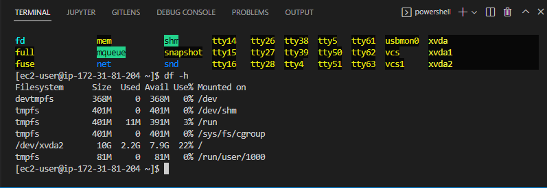
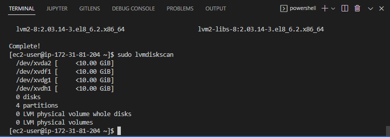
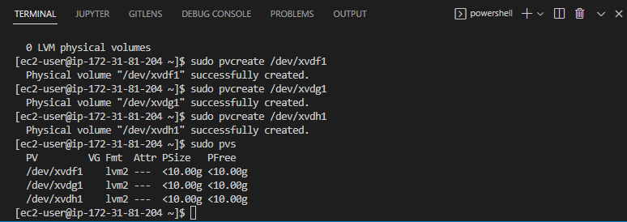

# DevOps PBL
# Project 6 Report

# Darey.io - DevOps Project Base Learning Project6 Documentation

AUGUST 2022

## WEB SOLUTION WITH WORDPRESS

## Web Solution with WORDPRESS

You are progressing in practicing to implement web solutions using different technologies. As a DevOps engineer you will most probably encounter PHP-based solutions since, even in 2021, it is the dominant web programming language used by more websites than any other programming language.

In this project you will be tasked to prepare storage infrastructure on two Linux servers and implement a basic web solution using WordPress. WordPress is a free and open-source content management system written in PHP and paired with MySQL or MariaDB as its backend Relational Database Management System (RDBMS).

Project 6 consists of two parts:
1. Configure storage subsystem for Web and Database servers based on Linux OS. The focus of this part is to give you practical experience of working with disks, partitions and volumes in Linux.
2. Install WordPress and connect it to a remote MySQL database server. This part of the project will solidify your skills of deploying Web and DB tiers of Web solution.

### Three-tier Architecture
Generally, web, or mobile solutions are implemented based on what is called the **Three-tier Architecture.**
**Three-tier Architecture** is a client-server software architecture pattern that comprise of 3 separate layers.
1. Presentation Layer (PL): This is the user interface such as the client server or browser on your laptop.
2. Business Layer (BL): This is the backend program that implements business logic. Application or Webserver
3. Data Access or Management Layer (DAL): This is the layer for computer data storage and data access. Database Server or File System Server such as FTP server, or NFS Server

### Our 3-Tier Setup
1. A Laptop or PC to serve as a client
2. An EC2 Linux Server as a web server (This is where you will install WordPress)
3. An EC2 Linux server as a database (DB) server

**We will use RedHat OS for this project**
By now you should know how to spin up an EC2 instanse on AWS, but if you forgot – refer to [Project1 Step 0](https://github.com/samuelede/devops-pbl-projects/tree/main/project1#step-0--web-stack-implementation-lamp-stack-in-aws)

### Step 1 - Prepare a Web Server

**Step 1 of 1** - Launch an EC2 instance that will serve as "Web Server". Create 3 volumes in the same AZ as your Web Server EC2, each of 10 GiB.

Step 1 of 2 - Next click Volumes as indicated above and also click create volume in the page tha appears.

Step 1 of 3 - Change the size to 10 GiB, ensure thee availability zone corresponds with the instance created and select crete volume.

Step 1 of 4 - In the volumes page, select each volume created select actions and then attach volume as indicated above to attach the volumes to our creted instance.

Step 1 of 5 - In the attach volume page, select the available instance and click attach volume for each volume selected in the previous step. 

Step 1 of 6 - Scroll to the right of the volumes pane to view and confirm all volumes are attached and ready to use.

Step 1 of 7 - Open up the Linux terminal to begin configuration on the Web Server instance. Use `lsblk` command to inspect what block devices are attached to the server. Notice names of your newly created devices. 

Step 1 of 8 - All devices in Linux reside in /dev/ directory. Inspect it with ` ls /dev/ `
and make sure you see all 3 newly created block devices there – their names will likely be *xvdf xvdg xvdh*. 

Step 1 of 9 - Use `df -h` command to see all mounts and free space on your server

Step 1 of 10 - Use *gdisk* utility to create a single partition on each of the 3 disks

Run the following commands separately and follow the pompts below `sudo gdisk /dev/xvdf` | `sudo gdisk /dev/xvdg` | `sudo gdisk /dev/xvdh`

Step 1 of 11 - Next, follow the prompts, enter `n` to create a new partition, then follow the default values as shown above, then enter `w` to write table to disk and exit followed by *yes* to complete the operation. Repeat the same steps for the remaining two volumes.

Step 1 of 12 - Use `lsblk` utility to view the newly configured partition on each of the 3 disks.

Step 1 of 13 - Install *lvm2* package using `sudo yum install lvm2`. Run `sudo lvmdiskscan` command to check for available partitions.

Note: Previously, in Ubuntu we used *apt* command to install packages, in **RedHat/CentOS** a different package manager is used, so we shall use *yum* command instead.

Step 1 of 14 - Use *pvcreate* utility to mark each of 3 disks as physical volumes (PVs) to be used by LVM. Run the following commands one by one.
`sudo pvcreate /dev/xvdf1`
`sudo pvcreate /dev/xvdg1`
`sudo pvcreate /dev/xvdh1`
Then, Verify that your Physical volume has been created successfully by running `sudo pvs`

Step 1 of 15 - Use *vgcreate* utility to add all 3 PVs to a volume group (VG). Name the VG webdata-vg by running the code: 
`sudo vgcreate webdata-vg /dev/xvdh1 /dev/xvdg1 /dev/xvdf1`
Next, verify that your VG has been created successfully by running `sudo vgs`

Step 1 of 16 - Use lvcreate utility to create 2 logical volumes. apps-lv (Use half of the PV size), and logs-lv Use the remaining space of the PV size. NOTE: apps-lv will be used to store data for the Website while, logs-lv will be used to store data for logs. Run the following commands individually:
`sudo lvcreate -n apps-lv -L 14G webdata-vg` then
`sudo lvcreate -n logs-lv -L 14G webdata-vg`
Next, Verify that your Logical Volume has been created successfully by running `sudo lvs`

Step 1 of 17 - Verify the entire setup. Run the following command.
`sudo vgdisplay -v #view complete setup - VG, PV, and LV`
`sudo lsblk`

Step 1 of 18 - Use *mkfs.ext4* to format the logical volumes with *ext4* filesystem. Run the commands below separately.
`sudo mkfs -t ext4 /dev/webdata-vg/apps-lv`
`sudo mkfs -t ext4 /dev/webdata-vg/logs-lv`

Step 1 of 19 - Create /var/www/html directory to store website file

`sudo mkdir -p /var/www/html`

Create /home/recovery/logs to store backup of log data `sudo mkdir -p /home/recovery/logs`
Mount /var/www/html on apps-lv logical volume 

`sudo mount /dev/webdata-vg/apps-lv /var/www/html/`

Next, use *rsync* utility to backup all the files in the log directory */var/log* into **/home/recovery/logs** (This is required before mounting the file system)

`sudo rsync -av /var/log/. /home/recovery/logs/`
 

Step 1 of 20 - Mount /var/log on logs-lv logical volume. (Note that all the existing data on /var/log will be deleted. That is why step 15 above is very important) 
`sudo mount /dev/webdata-vg/logs-lv /var/log`

Restore log files back into /var/log directory 

`sudo rsync -av /home/recovery/logs/. /var/log`

Step 1 of 21 - Update */etc/fstab* file so that the mount configuration will persist after restart of the server. To do this, the UUID of the device will be used to update the */etc/fstab* file; Run the following commands:
`sudo blkid` then copy the UUID’s as indicated in the image above and save in a note pad then run the command `sudo vi /etc/fstab`

Step 1 of 22 - Update the file with the copied UUID’s as shown above and save remembering to remove the double quotes “”.

Step 1 of 23 - Test the configuration and reload the daemon by running the following command 

`sudo mount -a`

`sudo systemctl daemon-reload`

Verify your setup by running 

`df -h`, 

output must look like the above image.

Step 2 - Prepare the Database Server

Launch a second RedHat EC2 instance that will have a role – ‘DB Server’. Repeat the same steps as for the Web Server, but instead of *apps-lv* create *db-lv* and mount it to 
*/db* directory instead of */var/www/html/*

On completion, the final step should look like the above image.

Step 3 - Install WordPress on your Web Server EC2

Step 3  of 1 - Update the repository. Run the command `sudo yum -y update` 
Install wget, Apache and it’s dependencies

`sudo yum -y install wget httpd php php-mysqlnd php-fpm php-json`

Start Apache with the folowing commands
`sudo systemctl enable httpd`

`sudo systemctl start httpd`

Step 3 of 2 - To install PHP and it’s dependencies, run each of the commands below

`sudo yum install https://dl.fedoraproject.org/pub/epel/epel-release-latest-8.noarch.rpm`

`sudo yum install yum-utils http://rpms.remirepo.net/enterprise/remi-release-8.rpm`

`sudo yum module list php`

`sudo yum module reset php`

`sudo yum module enable php:remi-7.4`

`sudo yum install php php-opcache php-gd php-curl php-mysqlnd`

`sudo systemctl start php-fpm`

`sudo systemctl enable php-fpm`

`sudo setsebool -P httpd_execmem 1`

Then, Restart Apache with the command

`sudo systemctl restart httpd`

Step 3 of 3 - Download wordpress and copy wordpress to *var/www/html*

Run the following commands:

` mkdir wordpress`
  `cd   wordpress` 
  
 ` sudo wget http://wordpress.org/latest.tar.gz`
 
   `sudo tar xzvf latest.tar.gz`
   
`  sudo rm -rf latest.tar.gz`

`sudo cp wordpress/wp-config-sample.php wordpress/wp-config.php`

`sudo cp -R wordpress /var/www/html/`

Step 3 of 4 - Configure SELinux Policies

 `sudo chown -R apache:apache /var/www/html/wordpress`
 
  `sudo chcon -t httpd_sys_rw_content_t /var/www/html/wordpress -R`
  
  `sudo setsebool -P httpd_can_network_connect=1`

### Step 4 - Install MySQL on DB Server EC2

On the DB Server instance created earlier, we type the commands below to install our sql server.
 `sudo yum update`
 
`sudo yum install mysql-server`

Verify that the service is up and running by using 
`sudo systemctl status mysqld`

If it is not running, restart the service and enable it so it will be running even after reboot:
`sudo systemctl restart mysqld`

`sudo systemctl enable mysqld`

### Step 5 - Configure DB to work with WordPress

Step 5 - Run the following commands to configure a new database for wordpress

`sudo mysql`

`CREATE DATABASE wordpress;`

`CREATE USER 'myuser '@' <Web-Server-Private-IP-Address>' IDENTIFIED BY 'mypass';`

`GRANT ALL ON wordpress.* TO 'myuser'@'<Web-Server-Private-IP-Address>';`

`FLUSH PRIVILEGES;`

`SHOW DATABASES;`

`exit`

### Step 6 - Configure WordPress to connect to remote database

**Step 6 of 0** - Select the Web Server instance and copy the private ip addres. This will be used to open MySQL port 3306 on DB Server EC2 for incoming connections from the web server.

**Step 6 of 1** - Select Security groups under Network & Security menu in the EC2 home page and under actions click edit inbound rules. Edit the **MYSQL/Aurora** source ip by pasting the copied `<ip-address>/32` as shown above.

**Step 6 of 2** - Install MySQL client and test that you can connect from your Web Server to your DB server by using *mysql-client*

`sudo yum install mysql`
`sudo mysql -u admin -p -h <DB-Server-Private-IP-address>`
Verify if you can successfully execute `SHOW DATABASES;` command and see a list of existing databases.

**Step 6 of 3** - Ensure to change permissions and configuration so Apache could use WordPress: Enable TCP port 80 in Inbound Rules configuration for your Web Server EC2 (enable from everywhere 0.0.0.0/0 or from your workstation’s IP) as shown above.

**Step 6 of 4** - Try to access from your browser the link to your WordPress `http://<Web-Server-Public-IP-Address>/wordpress/`

**Step 6 of 5** - As shown above, click continue with the english selection, then fill in the DB credential details in the following page.

If you see the above message – it means your WordPress has successfully connected to your remote MySQL database. 
We have completed configuring a Linux storage susbystem and have also deployed a full-scale Web Solution using WordPress CMS and MySQL RDBMS!

