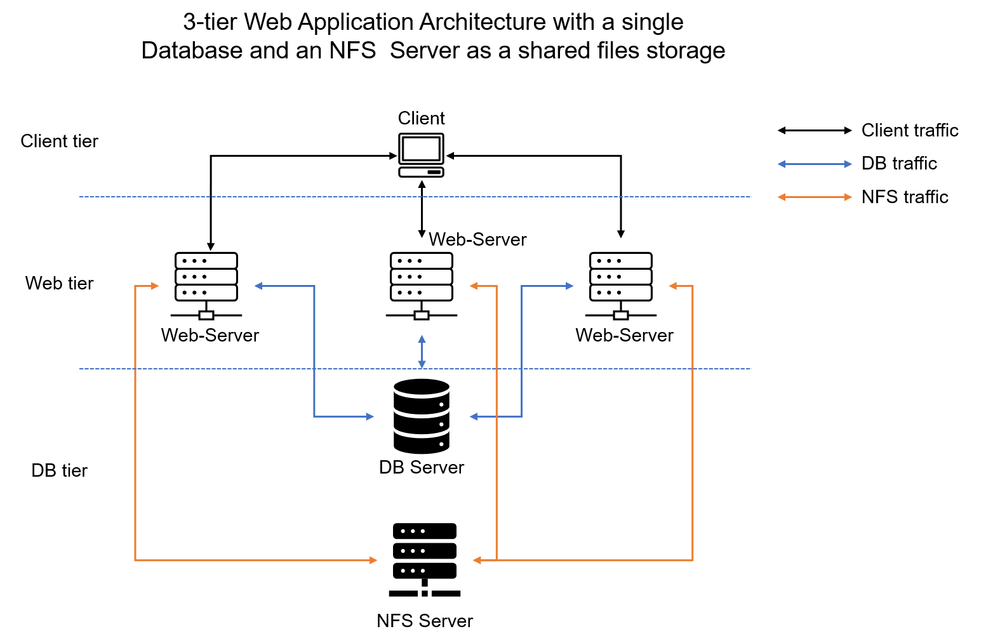
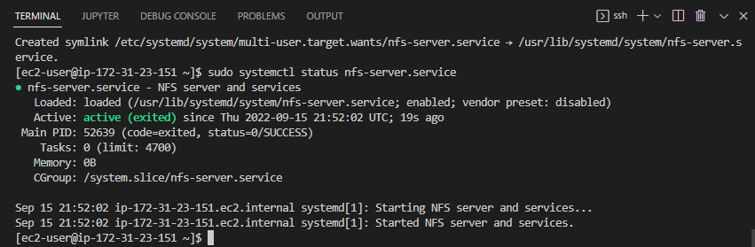

# DevOps PBL
# Project 7 Report

# Darey.io - DevOps Project Base Learning Project 7 Documentation

AUGUST 2022

## DEVOPS TOOLING WEBSITE SOLUTION

### Setup and technologies used in Project 7
As a member of a DevOps team, you will implement a tooling website solution which makes access to DevOps tools within the corporate infrastructure easily accessible.

In this project you will implement a solution that consists of following components:

1. Infrastructure: AWS
2. Webserver Linux: Red Hat Enterprise Linux 8
3. Database Server: Ubuntu 20.04 + MySQL
4. Storage Server: Red Hat Enterprise Linux 8 + NFS Server
5. Programming Language: PHP
6. Code Repository: GitHub

On the diagram below you can see a common pattern where several stateless Web Servers share a common database and also access the same files using Network File Sytem (NFS) as a shared file storage. Even though the NFS server might be located on a completely separate hardware – for Web Servers it look like a local file system from where they can serve the same files.

### Step 1 – Prepare NFS Server
Spin up a new EC2 instance with RHEL Linux 8 Operating System.

Based on your LVM experience from [Project 6](https://github.com/samuelede/devops-pbl-projects/tree/main/project6#step-1---prepare-a-web-server), follow the steps and setup a server named NFS Server to Configure LVM on the Server.

Instead of formating the disks as **ext4** you will have to format them as **xfs**

Ensure there are 3 Logical Volumes. *lv-opt* *lv-apps*, and *lv-logs*

Create mount points on /mnt directory for the logical volumes as follow:

**Mount lv-apps** on **/mnt/apps** – To be used by webservers

**Mount lv-logs** on **/mnt/logs** – To be used by webserver logs

**Mount lv-opt** on **/mnt/opt** – To be used by Jenkins server in Project 8

Install *NFS server*, configure it to start on reboot and make sure it is up and running. Run the following commands
`sudo yum -y update`

`sudo yum install nfs-utils -y`

`sudo systemctl start nfs-server.service`

`sudo systemctl enable nfs-server.service`

`sudo systemctl status nfs-server.service`

