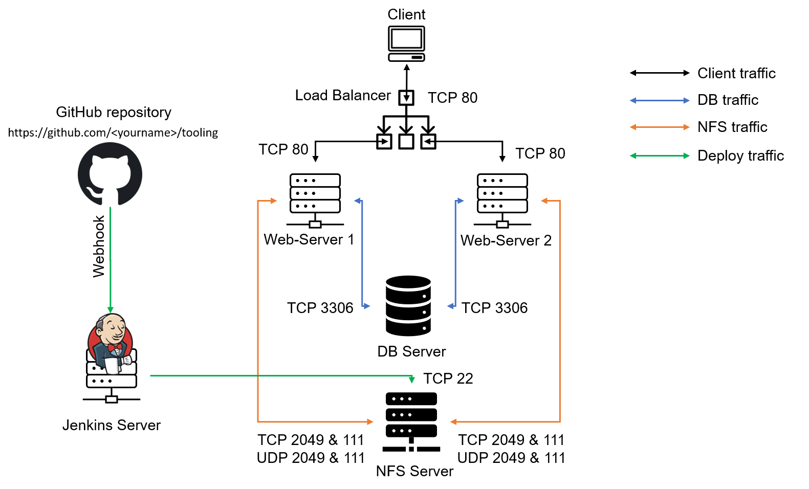

# DevOps PBL
# Project 9 Report

# Darey.io - DevOps Project Base Learning Project 9 Documentation

October 2022

## TOOLING WEBSITE DEPLOYMENT AUTOMATION WITH CONTINUOUS INTEGRATION. INTRODUCTION TO JENKINS

### Task
Enhance the architecture prepared in Project 8 by adding a Jenkins server, configure a job to automatically deploy source codes changes from Git to NFS server.

Here is how your updated architecture will look like upon competion of this project:



### INSTALL AND CONFIGURE JENKINS SERVER
### Step 1 – Install Jenkins server
1. Create an AWS EC2 server based on Ubuntu Server 20.04 LTS and
name it "Jenkins"
2. Install JDK (since Jenkins is a Java-based application)

Run the following commands:

`sudo apt update`
`sudo apt install default-jdk-headless`

3. Install Jenkins
```
wget -q -O - https://pkg.jenkins.io/debian-stable/jenkins.io.key |
sudo apt-key add -
sudo sh -c 'echo deb https://pkg.jenkins.io/debian-stable binary/ >
\
/etc/apt/sources.list.d/jenkins.list'
sudo apt update
sudo apt-get install jenkins
```

Run the following command to ensure Jenkins is up and running

`sudo systemctl status jenkins`

4. By default Jenkins server uses TCP port 8080 – open it by creating a
new Inbound Rule in your EC2 Security Group

5. Perform initial Jenkins setup.
From your browser access
http://<Jenkins-Server-Public-IP-Address-or-Public-DNS-Name>:8080
You will be prompted to provide a default admin password

Retrieve it from your server:

`sudo cat /var/lib/jenkins/secrets/initialAdminPassword`

Once plugins installation is done – create an admin user and you will getyour Jenkins server address.
The installation is completed!
